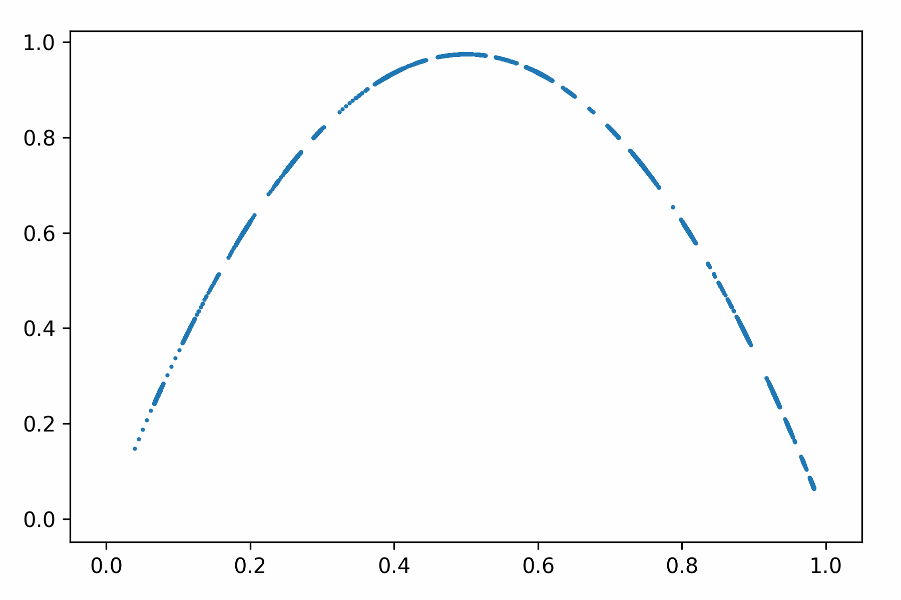
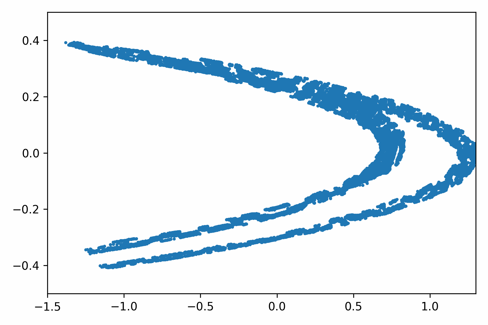

The Python scripts for training the DRL model are shown in the folders experiment1 and experiment2. Reset the GlobalPath of ``LearnTrueActionEnv.py `` and run the file ``LearnTrueActionEnv_Train.py`` to train agents of experiment1. Reset the GlobalPath of ``HybridMultDimChaosControlEnv.py ``, ``HybridMultDimChaosControlEnv2.py``, ``HybridMultDimChaosControlEnv3.py``, ``HybridMultDimChaosControlEnv4.py``and run the file ``3ChaosEnvTrain.py``,``TrainChaosEnv4.py`` to train agents of experiment2. Run the file ``OGYCompare.py`` to observe the result.

